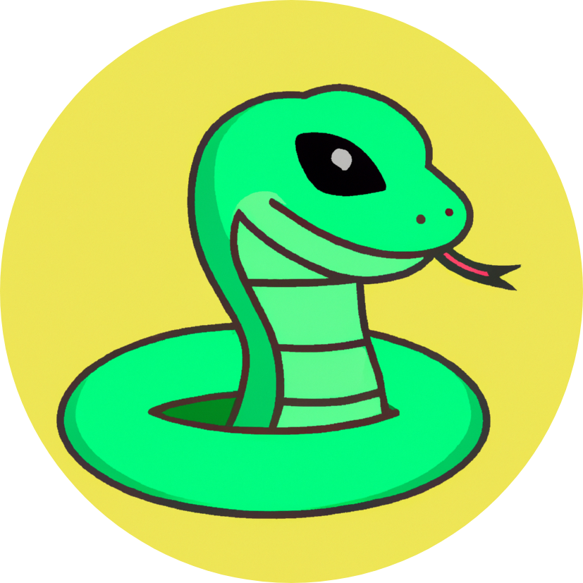

<p align="center">
  <a href="" rel="noopener">
 </a>
</p>

<h3 align="center">Snake</h3>

<div align="center">

[]()
[](https://github.com/souviksaha97/Snake/issues)
[](https://github.com/souviksaha97/Snake/pulls)
[](/LICENSE)

</div>

---

<p align="center"> A hobby project developed by Souvik Saha
    <br> 
</p>

## 🧐 About

The Snake Game is a classic and captivating arcade experience in which players control a snake that slithers around a bordered canvas. The primary objective is to maneuver the snake to consume food items, which causes it to grow longer with each meal. The catch is to avoid colliding with the snake's own tail during this endeavor. As the snake increases in length, the challenge intensifies, demanding strategic planning and swift reactions from players. The absence of walls increases the risk, as the snake can travel off the canvas and reappear on the opposite side. This rendition faithfully recaptures the magic of the original Snake Game, enabling players to immerse themselves in the timeless joy of this iconic pastime.

<p align="center">
  
</p>

## 🏁 Getting Started

These instructions will get you a copy of the project up and running on your local machine.

### Prerequisites

- Python

### Installing

A step by step series of examples that tell you how to get a development env running.

Install requirements.txt

```bash
pip install -f requirements.txt
```

## 🔧 Playing the game

```bash
python3 GameManager.py
```

## ✍️ Authors

- [@souviksaha97](https://github.com/souviksaha97)
